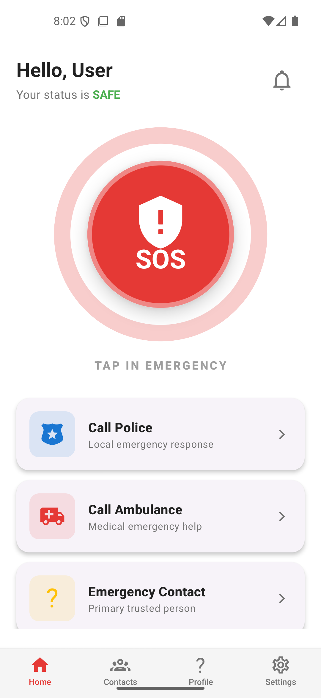
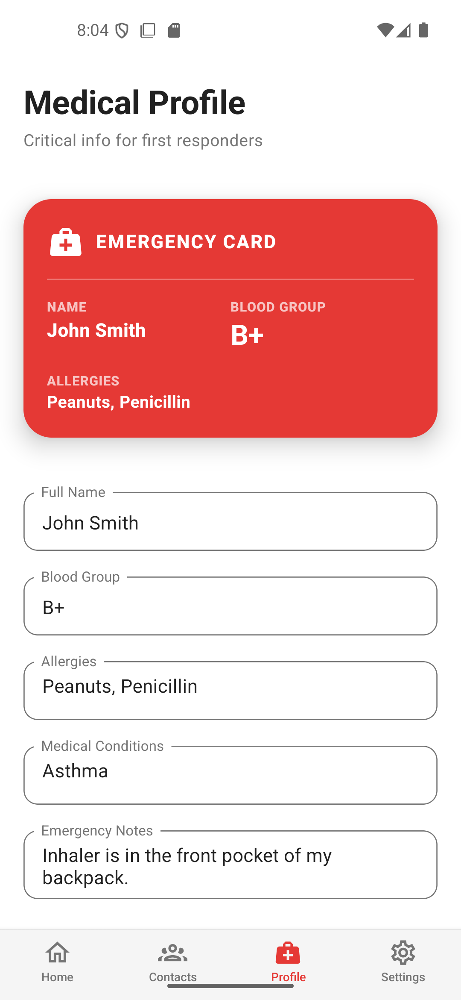

# 🚨 SafeLink – Offline Emergency Help App

SafeLink is a modern, mobile-first emergency assistance application designed to provide fast and reliable help during critical situations — even without internet connectivity.

The app focuses on **speed, accessibility, and user safety**, ensuring that help is always available when it matters most.

---

## ✨ Features

* 🚨 One-Tap SOS Alert
* 📡 Works Offline (Emergency Mode)
* 👥 Emergency Contact Notification
* 📍 Location Sharing (when available)
* ⏱️ Safety Timer
* 🔐 User Authentication (Firebase)
* 📱 Mobile-First UI (Easy to use under stress)

---

## 🛠️ Tech Stack

* **Frontend:** React Native (Expo), React.js
* **Backend & Database:** Firebase (Authentication + Firestore)
* **State Management:** React Hooks / Context API
* **UI:** Bootstrap / Custom UI Design
* **Version Control:** Git & GitHub

---

## 🎯 Purpose of the Project

This project solves a real-world problem where users may not have internet access during emergencies.
SafeLink ensures users can still **trigger alerts and reach help quickly**, improving safety and response time.

---

## 📸 Screenshots

*screenshots inside a `screenshots` folder*





---

## 🚀 Installation & Setup

```bash
# Clone the repository
git clone https://github.com/kasthooriGithub/safelink.git

# Navigate into project folder
cd safelink

# Install dependencies
npm install

# Start the app
npx expo start
```

---

## 📌 Future Improvements

* 🔔 Push Notifications (real-time alerts)
* 🌍 Live location tracking
* 📞 Direct emergency service integration
* 🔊 Voice-triggered SOS

---

## 👨‍💻 Author

**Kasthoori**

* GitHub: https://github.com/kasthooriGithub
* Portfolio: portfolio-link

---
